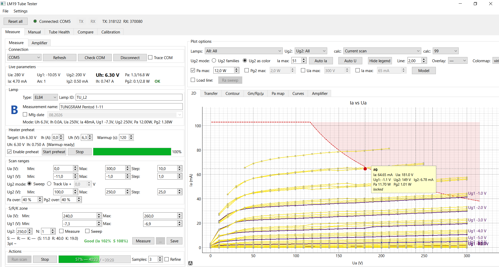
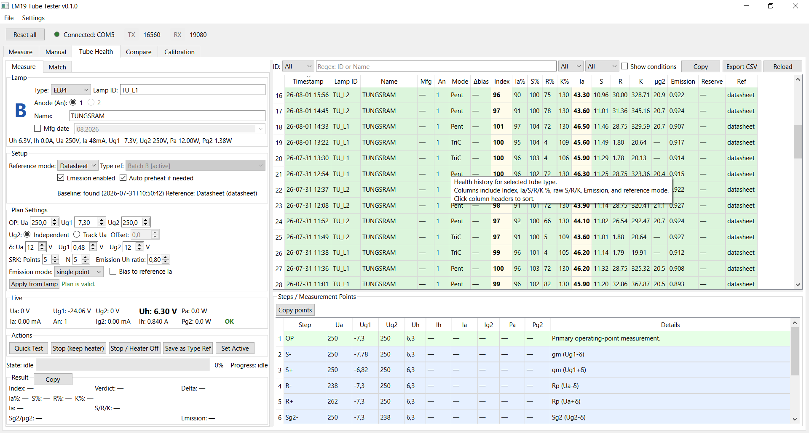

# LM19 Tube Tester GUI

Python GUI application for the LM19 (AVT5229) vacuum tube tester.  
Communicates with the device over COM port.



## What it does

- **Trace a tube automatically** — sweep Ua/Ug1/Ug2 into full I-V curve
  families, with stabilization, protection limits and optional adaptive
  refinement around the knee. → [Measure Tab](#measure-tab)
- **Judge whether a tube is still good** — a quick health test measures S/R/K
  and emission and turns them into a verdict against the type's nominals,
  with per-tube history. → [Health Tab](#health-tab)
- **Match tubes into pairs and quads** — by operating-point parameters
  (Ia/S/R) or by whole-curve similarity, with amp-class weighting and a
  printable matched-set certificate. → [Health Tab](#health-tab),
  [Compare Tab](#compare-tab)
- **Design an amplifier stage on the measured tube** — load lines and working
  lines for SE, SE-transformer, cathode-follower and push-pull (incl.
  ultralinear), distortion by three methods, and a multi-parameter optimizer
  that returns a Pareto front of THD vs Pout. → [Amplifier Tab](#amplifier-tab)
- **Cross-check the analysis and export the design** — fit a SPICE model
  (Koren / Dempwolf / Reefman), verify the stage by running it through
  LTspice, and export the `.sub` model plus ready-to-simulate schematics.
  → [Amplifier Tab](#amplifier-tab), [Export Formats](#export-formats)
- **Get it on paper and off the bench** — PDF reports and certificates, CSV /
  uTracer import-export, plus manual control and calibration of every channel.
  → [Export Formats](#export-formats), [Calibration Tab](#calibration-tab)

The full breakdown follows.

## Features

### Measure Tab
- **Automated scanning** — full parametric sweep of Ua, Ug1, Ug2 with configurable ranges and steps
- **Two scan modes**: Sweep (independent Ug2) for pentodes/tetrodes and Track (Ug2 = Ua + offset) for triode connection
- **Scan stabilization** — dynamic settle times proportional to voltage change, verification with retries, per-parameter tolerance (Ua, Ug1, Ug2)
- **Ia/Ig2 averaging** — configurable number of interleaved current readings per point (Samples control in UI)
- **Adaptive refine** — optional two-pass scan: coarse sweep then automatic bisection in knee/onset/kink regions (5 physics-based criteria)
- **S/R/K measurement** — transconductance (S), plate resistance (R), amplification factor (K) via 4-point zone method with configurable averaging
- **Heater preheat** — configurable ramp and warmup time before measurements
- **Plot types**:
  - 2D plot: Ia(Ua) curves grouped by Ug1, colored by Ug2
  - Transfer plot: Ia(Ug1) for each Ua value, with view presets
    (All / Datasheet / Load line / Custom Ua slices), working-line
    accents, and a PP composite curve
  - Heatmaps: Contour Ia(Ua, Ug1), Gm, Rp, µ, and Pa dissipation maps —
    each with a value colorbar; a **Lock scale** checkbox freezes the
    color levels so two scans become directly color-comparable
  - Curves: parametric plots of Gm/Rp/µ/Ia/Ig2/Pa vs any axis
- **Load line analysis** — visual load line with distortion calculation (HD2, HD3, Pout), Q-point and swing markers
- **Live working line** — the amplifier working line (SE/CF/PP, including the PP class-A→AB kink) follows the amp-panel controls directly on the 2D plot with debounced recompute
- **Ra sweep** — sweep load resistance to find optimal operating point
- **Safety visualization** — Pa_max hyperbola, Ua_max, Ia_max zones on plots
- **Real-time incremental plotting** during scan
- **Save/load** scan settings and measurement results; a failed save opens a recovery dialog (retry / save elsewhere) instead of dropping the data

### Manual Tab
- **Direct parameter control** — set Ua, Ug1, Ug2, Uh, Ih individually with verification
- **Live readings** — Ua, Ug1, Ug2, Uh, Ih, Ia, Ig2, An, Pa in real time
- **Single point measurement** — take individual points with table view and clipboard copy
- **Real-time Ia/Ig2 chart** — dual Y-axis rolling history (60 s), configurable appearance
- **Add manual points to main plot** or save with SRK measurement

### Health Tab



- **Tube health assessment** — automated quick test with SRK + emission measurement
- **Accuracy options** — bias servo (S measured at the reference anode current;
  the bias shift itself is a wear-vs-grid-contamination discriminator) and
  deep-emission sweep (Ia(Uh) curve with cathode-reserve knee detection)
- **Planned-steps preview** — the upcoming test plan (Ua/Ug1/Ug2/Uh/Ih per step) is shown before the run
- **Protection dialog** — a protection trip during the OP ramp shows every measured value, both limits, and likely causes
- **Verdicts** — Good / Weak / Replace based on configurable thresholds vs tube type nominals
- **Measurement history** — persistent tracking per tube with timestamps
- **Tube matching** — two modes:
  - **Groups** — pair/quad matching by Ia, S, R (Hungarian algorithm for pairs, greedy for larger groups)
  - **Similar to** — rank tubes by distance from a selected reference
- **Curve-based matching** (Compare sub-tab) — full Ia(Ua) curve comparison with amp-class weighting (A/AB/B)
- **Configurable weights** — auto-switch between pentode (Ia+S) and triode (Ia+S+R) profiles

### Compare Tab
- **Multi-measurement overlay** — load and compare measurements from disk or external JSON files
- **Load entire folders** of measurements
- **Color customization** per measurement series
- **Clean legend semantics** — one solid entry per lamp in its color;
  Ug2 levels as neutral-gray line-style entries (shown only for levels
  enabled in the Ug2 filter panel)
- **Sortable table** by lamp type, ID, name, timestamp, S/R/K values
- **Details panel** with full measurement metadata
- **Export dropdown** — CSV, uTracer (.utd), SPICE (.sub), PDF for checked measurements with combined/separate modes

### Amplifier Tab
- **Amplifier topologies** — SE Resistive, SE Transformer, Cathode Follower, Push-Pull (triode and pentode variants)
- **Distortion analysis** — HD2, HD3, THD via three methods: 5-point Fourier, Chebyshev polynomial, DFT
- **Sweeps** — Ra sweep and amplitude sweep with selectable HD method
- **Three tube models** — Koren, Dempwolf, Reefman with fitting dialog and visual comparison
- **Ultralinear mode** — configurable UL tap percentage for PP pentode circuits
- **Optimizer** — three-phase (grid sweep → swing sweep → Pareto refinement via Nelder-Mead), configurable targets (min THD, max Pout, balanced) and constraints (Pa_max, Pout_min, THD cap, PP class-A power threshold); PP UL tap sweep over historical presets or a custom range
- **Pareto front visualization** — THD vs Pout trade-off plot
- **LTspice verification** — on-demand batch simulation of the analyzed circuit (Verify button): THD/HD2..HD9 from `.four`, average Ia from `.raw`, optional amplitude sweep and two-tone IMD; selectable fitter (Auto/Koren/Dempwolf/Reefman), engine vs LTspice side-by-side table
- **Grid current headroom** — Dempwolf Ig1 model for class A2 limit detection
- **Average Pa under signal** — numerical integration over sinusoidal cycle
- **SPICE export** — .sub subcircuit + .asy symbol + test/amplifier .asc schematics for LTspice

### Calibration Tab
- **Calibration wizard** — step-by-step calibration of all channels (Ua, Ug1, Ug2, Uh, Ih, Ia, Ig2);
  SET corrections are auto-derived from READ
- **Gain/offset coefficients** — stored in `config/calibration.json`
- **Feedforward** — SET corrections pre-correct every working-point command,
  READ corrections apply to every measurement (see `docs/CALIBRATION_GUIDE.md`)

### Export Formats
- **CSV** — flat table or parameter matrix, configurable separator, optional computed columns (Pa, Pg2, Ik)
- **uTracer (.utd)** — compatible with uTracer3 GUI, ExtractModel, Load Line Tool
- **SPICE (.sub)** — Koren/Dempwolf/Reefman models fitted to measured data (LTspice/ngspice compatible)
- **LTspice schematics (.asc)** — test circuits and amplifier circuits (SE, SE transformer, CF, PP)
- **PDF report** — A4 report with an options dialog (section checkboxes, Full/Brief presets), print-resolution plots, S/R/K ±%, quality, scan settings, distortion analysis; document language set by `config/app.json:report_language` ("" = English, unknown code → English with a log warning)
- **Amplifier PDF report** — results panel, harmonic spectrum, THD/Ra/Pareto plots, and the LTspice verification table (batch `.tran`/`.four` of the analyzed circuit; amplitude sweep and two-tone IMD options)
- **Matched pair/quad certificate** — PDF for a matched group from the Health Match panel or the Compare tab (Ia/S/R or curve-match basis, any report language)

### Import Formats
- **CSV** — auto-detect separator and column mapping, supports various tube tester formats
- **uTracer (.utd)** — output and transfer curves, auto-guess metadata from filename
- **CurveTraceData (.dat)** — imports raw pypsucurvetrace data (Ua/Ug1/Ia), skips limiter-clamped rows

### General
- **Lamp database** — dozens of tube types with configurable parameters, scan ranges, and device limits
- **COM port management** — auto-selection, connection check, trace logging
- **Live parameter polling** — configurable interval
- **Plot customization** — line width, colors, legend, axis limits, hover tooltips with snap-to-curve
- **Internationalization** — runtime-switchable UI language; locales are auto-discovered from `locales/*.json` (English is the fallback for missing keys), so adding a translation file requires no code changes
- **Parameter debug logging** to file
- **Application version** — shown in the window title and in the footer of every generated PDF (scan report, amplifier report, matched-tubes certificate); defined in `lm19/version.py`

## Setup

Requires **Python 3.12+**. Runtime dependencies (PySide6, pyqtgraph,
pyserial, numpy, scipy) are listed in `requirements.txt`; test tooling
(pytest and plugins) in `requirements-dev.txt`.

Installing into a virtual environment is recommended — the runtime
dependencies are large.

1. Install dependencies:
   ```
   python -m pip install -r requirements.txt
   ```
   For development/testing:
   ```
   python -m pip install -r requirements-dev.txt
   ```
2. Run the app:
   ```
   python -m app.main
   ```

## Tests

```bash
python -m pytest tests/ -v
```

Smoke tests (fast critical-path subset):
```bash
python -m pytest tests/ -v -m smoke
```

## Project Structure

```
.
├── app/                  # UI layer (PySide6) — tabs, dialogs, workers, plotting
├── lm19/                 # core logic (no Qt) — scan, models, amplifier, optimizer, I/O
├── config/               # JSON configs + LTspice templates
├── locales/              # UI translations (*.json, auto-discovered; en = fallback)
├── measurements/         # saved measurements (override via config/app.json)
├── health_measurements/  # health test results
├── external_sources/     # local copies of external data and theory references
├── tests/                # pytest suite
├── docs/                 # technical documentation (see Documentation section)
├── tools/                # maintenance & benchmark utilities (see Tools section)
└── i18n_setup.py         # t(), setup(locale), locale discovery
```

## Configuration

Full reference: `docs/CONFIG_REFERENCE.md`.

| File | Purpose |
|------|---------|
| `config/app.json` | General settings (locale, serial, logging, UI defaults) |
| `config/device.json` | Hardware limits (max voltages, currents) |
| `config/scan.json` | Scan parameters (settle, verify, averaging) |
| `config/srk.json` | SRK measurement parameters |
| `config/health.json` | Health thresholds, matching weights and config |
| `config/calibration.json` | Calibration coefficients (gain/offset per channel) |
| `config/lamps.json` | Lamp database (nominals, topology, scan ranges, limits) |
| `config/lamp_limits.json` | Extended lamp safety limits |
| `config/tube_params.json` | SPICE model reference parameters |

### Measurements

Saved as JSON files in `measurements/<lamp_type>/<lamp_id>__<timestamp>__<name>.json`. Each file contains scan settings, zone definition, S/R/K results, and raw measurement points.

Health measurements are saved separately in `health_measurements/<lamp_type>/`.

These roots are configurable via `config/app.json`:
- `measurements_dir` — defaults to `"measurements"` (relative to the application root)
- `health_measurements_dir` — defaults to `"health_measurements"`
- `health_refs_dir` — defaults to `"config/health_refs"`; holds the Tube Health
  reference set (`type/` and `personal/` subtrees)

Absolute paths are used as-is; relative paths resolve against the application root. The directory is auto-created on first use with a one-shot WARNING in the log.

## Documentation

User guides:

| Document | Description |
|----------|-------------|
| `docs/FEATURES.md` | Comprehensive feature list with all tabs |
| `docs/AMPLIFIER_GUIDE.md` | Amplifier tab operation and theory |
| `docs/PLOTS_GUIDE.md` | Plot types and interpretation |
| `docs/CONFIG_REFERENCE.md` | Configuration files reference |
| `docs/CALIBRATION_GUIDE.md` | Calibrating the device: wizard walkthrough, verification, limits |

Theory and methods:

| Document | Description |
|----------|-------------|
| `docs/SCAN_LOGIC.md` | IV-scan algorithms and sweep modes |
| `docs/AMPLIFIER_CALCULATIONS.md` | Amplifier calculation formulas |
| `docs/AMPLIFIER_THEORY_APPENDIX.md` | Theory and equations |
| `docs/SPICE_KOREN_MODELS.md` | Koren SPICE model theory |
| `docs/DEMPWOLF_EXTENDED_MODEL.md` | Dempwolf extended pentode model |
| `docs/TUBE_MODELS_COMPARISON.md` | Model comparison methodology |

The remaining files in `docs/` are internal development documents (plans, audits, research notes, session log).

## Tools

- `tools/extract_lamps.py` — extracts lamp definitions from the firmware source (`TTesterLCD.c`) and generates `config/lamps.json`
- `tools/sync_tdsl_limits.py` — synchronizes supported limit fields from TDSL and updates `config/lamp_limits.json`
- `tools/revise_lamp_params_from_tdsl.py` — nominal operating point revision using TDSL Application Data
- `tools/parse_tubelib.py` — parses TubeLib.inc SPICE library into structured data
- `tools/compare_models.py` — compares the production tube fitters (Koren, Dempwolf, Reefman — the latter picks the better of Derk/DerkE) against measured data. Run without args to list available tube types; pass type names to filter, or `--all` to process every type
- `tools/fit_benchmark.py` — benchmarks the three fitters on all converted test datasets (`python tools/fit_benchmark.py [filter] [--real] [--no-ref]`)
- `tools/optimizer_benchmark.py` — wall-clock benchmark of the amplifier optimizer hot paths
- `tools/bench_optimizer_hd_methods.py` — speed vs physics comparison of HD methods (5point/chebyshev/auto/dft) on real pentode data
- `tools/refine_efficiency.py` — measures adaptive-refine point savings vs approximation error on synthetic pentode scans
- `tools/working_line_bench.py` — performance gate for the live working-line render path
- `tools/koren_knee_research.py` — computes the EL84 reference-calibration anchors (single source for the calibration pin tests)
- `tools/ul_cheb_vs_dft.py` — regenerates the UL Chebyshev vs DFT equivalence table

## Tube Models

Three tube model fitters, all implementing `TubeModelProtocol`:

| Model | Module | Description |
|-------|--------|-------------|
| Koren | `lm19/tube_sim.py` | Classic SPICE model, LTspice export |
| Dempwolf | `lm19/dempwolf.py` | Extended model with improved knee |
| Reefman | `lm19/reefman.py` | Extended model |

SPICE export generates `.sub` subcircuit + `.asy` symbol + test/amplifier `.asc` schematics.
Templates in `config/templates/` cover 10 amplifier topologies (SE/SE-xfmr/CF/PP × triode/pentode).


## External Data Sources and Theory References

### Data Sources

- **TDSL (Duncan Tube Data Sheet Locator)**
  https://tdsl.duncanamps.com/show.php?des=...
  Used for lamp limits and reference values in `config/lamp_limits.json`, and in sync/revision tools.

- **Frank Pocnet tube datasheets (fallback sources)**
  https://frank.pocnet.net/sheets/
  Used as fallback references for missing TDSL entries in limits revision flow.

- **JJ Electronic datasheet (fallback source)**
  https://www.jj-electronic.com/images/stories/productinfo/ECC99.pdf
  Used as fallback reference for `ECC99` in lamp limits revision.

- **Norman Koren model/data sources**
  https://www.normankoren.com/Audio/Tube_params.html
  https://www.normankoren.com/Audio/Tuparam.zip
  https://www.normankoren.com/Audio/Tubemods.zip
  Used for SPICE model theory, fitting references, and converted test datasets.

- **Next-Tube empirical data**
  https://next-tube.com/data.php
  Used as external measured datasets, converted into unified JSON test inputs.

- **loadline_plotter datasets (GitHub)**
  https://github.com/andmarti1424/loadline_plotter
  Digitized datasheet curves for conversion and SPICE fitting validation.

- **pypsucurvetrace / curvetracedata (GitHub)**
  https://github.com/mbrennwa/pypsucurvetrace
  https://github.com/mbrennwa/curvetracedata
  High-density measured curve datasets for conversion and regression testing.

- **Duncan SPICE model library**
  https://duncanamps.com/spicemodels.html
  Additional reference model library.

- **Intusoft VACUUM.LIB reference**
  http://www.intusoft.com
  Historical SPICE library in raw test data corpus.

### Theory and Method References

- **Koren SPICE theory (core model basis)**
  https://www.normankoren.com/Audio/Tubemodspice_article.html
  https://www.normankoren.com/Audio/Tubemodspice_article_2.html

- **Reynolds / Leach tube modeling background**
  S. Reynolds, *Glass Audio* (1993); W. M. Leach Jr., *JAES* (1995)

- **Dempwolf / Reefman extended modeling**
  K. Dempwolf, U. Zolzer (DAFx-11, 2011); Reefman Derk/DerkE (2016)

- **uTracer ecosystem and file format**
  https://www.dos4ever.com/uTracer3/uTracer3.html
  
  
## License and provenance

The code in this repository is released under the MIT license (see
`LICENSE`). Test fixtures under `tests/spice_test_data/converted/` are
derived from external measurement datasets; the origin of each fixture
and the terms stated by its source are listed in (tests/spice_test_data/SOURCES.md).
Those terms, not the MIT license, govern the fixture data — notably the
`*_tuparam.json` set, which derives from Norman Koren's Tuparam data,
stated by its author as free for non-commercial use. Rights holders may
open an issue in this repository and any fixture will be removed on
request.

## Acknowledgments

This project was developed with the assistance of the following AI models: **Claude Opus**, **Claude Fable** (Anthropic)

